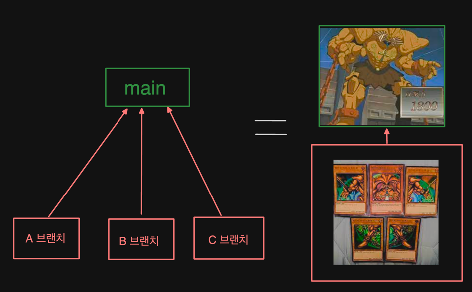
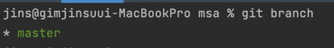
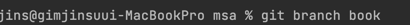
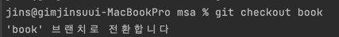
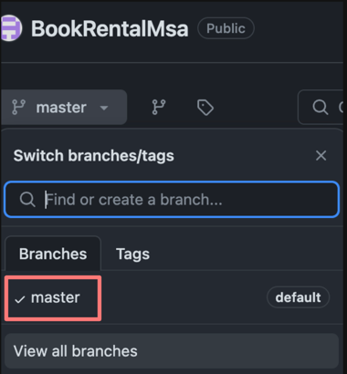
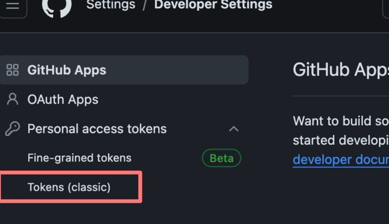
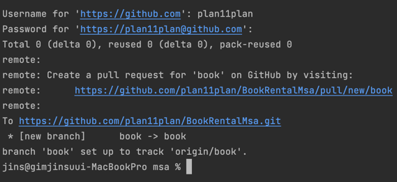

# homebuilding  프로젝트(4월 1일까지)


# 📕 실습 과제 요구사항 

개인적으로 해야하는 요구사항을 정리해보면<br>

 - [ ] 티켓 수 10개 만들기<br>
 - [ ] 티켓에 기간,담당자,우선순위, 사이즈 내용 채우기<br>
 - [ ] 집 짓기를 위한 로드맵 작성


- 예시 화면

---

# 📕 조별 과제 요구사항
 - [ ] public 프로젝트, 레포지터리 경로를 교수님 Email로 제출   
 - [x] 조장은 과제를 위한 조 Repository 만들기
 - [ ] 브랜치는 5개 이상 있어야함
 - [ ] 티켓별 담당자들은 해당티켓의 수행보고를 파일로 만들어 commit, push 하기
 - [ ] 조 Repository에는 모든 티켓들의 수행결과가 들어와야함
<br><br>
 - 제출 양식
    - 제목 : SW 설계 개발 x분반 x조 과제 제출
    - 내용 : 조원 정보(이름 및 깃헙 id 필수) , 프로젝트 url, 레포 url

# 🎁 깃 브랜치 나누기 & 커밋 가이드

## ❓ (잠깐) 브랜치를 나누는 이유 

역할을 나눌 수 있습니다.

# 나만의 브랜치 만들기 

### 1. 📩 프로젝트 clone 해오기 (프로젝트 가져오기)
 - 브랜치를 만들기 전에, 저희 main 레파지토리 프로젝트를 clone(가져오기)해야 합니다.
   - 다양한 clone 방법이 존재하고, 각자 IDE 환경에 따라 조금씩 클론 방법이 다를 수 있기 때문에 여러분들이 클론하기는 스스로 해주셔야 합니다.<br>(저는 인텔리제이 환경에서 했습니다)
   
### 2. 👀 나의 현재 branch 확인하기 
  ❗️자신의 프로젝트가 있는 경로에서  터미널에 다음 메세지를 입력합니다.
  <br>
  (혹시 터미널 어떻게 여나요?)  (이렇게 터미널을 열 수도 있습니다.)
```java
git branch
```
 <br>
master 브랜치 1개가 보입니니다. ( *이 붙은 브랜치는 현재 브랜치)

### 3. 👀 나만의 브랜치 만들기
❗ 터미널 명령어 입니다. 
```java
git branch 브랜치이름
```
(입력 예시)<br>


### 4. 👀 방금 만든 브랜치로 이동하기
```java
git checkout 브랜치이름
```
(입력 예시)<br>

<br>
### 5. 👀 원격 저장소에 , 새로운 브랜치 등록하기
그렇다면 이제 로컬에 생성된 브랜치를 원격저장소에도 반영해야합니다.

❗ 나만의 브랜치(book) 를 만들었지만 원격 저장소에는 반영이 안되어있어요.<br>
❗ (master 브랜치만 보이는 모습)<br>
<br>
등록을 위해 터미널에 다음 명령어를 입력합니다
```java
git push --set-upstream origin <새로운 브랜치1>
```
(입력 예시)<br>


그러면 막 뭔가 떠요.  
1. 유저이름을 입력해주세요 : 본인 깃허브 닉네임 입력하기
2. 비밀번호 입력해주세요 :  이거 만약 비밀번호 입력했는데 안된다면, 본인 깃허브 인증 토큰을 입력해야합니다. (아래 이어서 설명)

###  😭 비빌번호에서 막힌 경우.
<br>
<br>
<br>

이 다음 부터는 개인정보가 들어가 있어서 보여줄수 없어요.<br>
아예 처음이신분들은 Generate new token해서 대충 만드셔서
토큰 값 생성해서 복붙하시면 되요.(토큰 생성시 꼭 어딘가 적어두세요.)<br>
만약 이전에 토큰을 한번 발행했던 분들은 재발행해서 복붙하시면 됩니다.<br>


토큰값을 복사하셨다면 터미널에 입력해주세요. 여기까지 잘 됐다면 다음 화면이 나옵니다.
 <br>

드디어 원격저장소에 새로운 브랜치가 반영됐어요

여기까지가 브랜치 만들기 가이드입니다.

---
# 🔥commit 하기
(이 부분은 팀원분들에게 맡기겠습니다)

---


## 🍒역할 및 진행 완료 표시
- [ ] [집 구상] - 이재웅
- [ ] [실내외 디자인] - 정지석
- [ ] [시공사 및 자제 검수] - 촤강희
- [x] [건축 순서 설계] - 김진수
- [ ] [리뷰어] - 김현우
## 🍒 역할 배정 과정
1. 팀원 5명  --> 5개의 브랜치로 나누는 것을 목표 --> 5개의 주제로 세분화
2. 다같이 내용 채움
3. 각자 원하는 주제 선정


